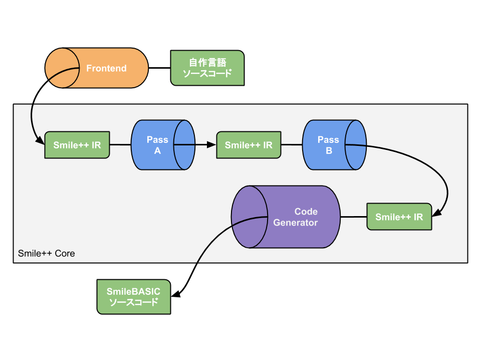

# Smile++

 

SmileBASICを目的コードとする言語処理系の基盤

<!-- ## 関数ライブラリ

## トランスパイラ

Smile++独自の構文で記述したPRGリソースを、SmileBASICインタプリタで実行可能な通常のPRGリソースに変換するプログラム。  
字句解析を行いそれぞれの単語の種類を特定したうえで、独自構文を使用している部分を抽出し通常の構文を使った等価のコードに置き換えて、PRGリソース全体を再構築し出力します。-->

## フロントエンド

ソースコードを受け取り、Smile++ IR を出力するプログラム

## Smile++ Core

いくつかの **Pass** ( Smile++ IRを入力として受け取り、Smile++ IR を出力するプログラム ) が連結し、  
フロントエンドで生成された Smile++ IR がそれらを通して解析・編集されていく。

最終的に Code Generator を通して Smile++ IR から SmileBASIC のソースコードが出力される。
